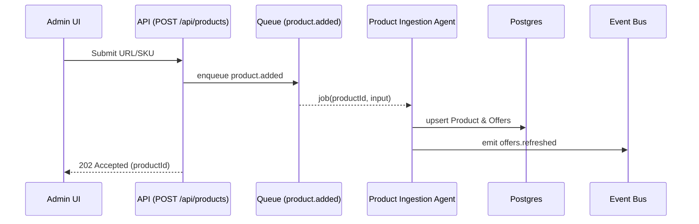
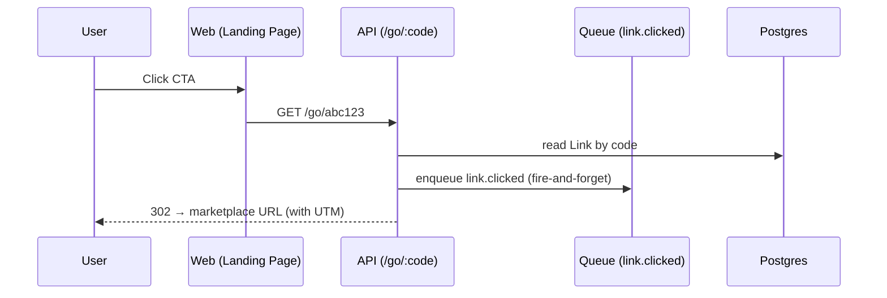
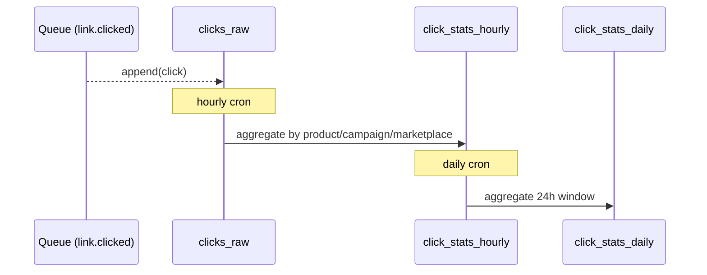

# AGENTS.md — Affiliate Platform (Promotion & Marketplace Price Comparison)

This document describes the **agent-oriented architecture** for the Affiliate Platform. It maps each requirement (product/price comparison, affiliate link generation, promotion landing page, analytics) into small, independent agents coordinated by an event bus and background jobs.

> Guiding principles: small services, clear contracts, observable by default, idempotent work, retries with backoff, and security-first redirects.

---

## High-level overview

- **Frontend**: Next.js 14 app (`/apps/web`) using the App Router + ISR for public pages and an Admin UI for product & campaign management.
- **Backend API**: NestJS 10 service on Node 20 (`/apps/api`) exposing REST endpoints and emitting/consuming events.
- **Adapters**: `/packages/adapters` provide marketplace-specific integrations (Lazada, Shopee), with mock fixtures fallback.
- **Mock data**: Versioned fixtures + seed scripts under `/packages/adapters/mocks` keep local development and CI runs deterministic.
- **Storage**: Postgres 16 (core entities), Redis 7.2 (queues, caching, rate limits), optional S3 (images/exports).
- **Workers**: Node 20 worker processes running agents via BullMQ queues.
- **Event bus**: Redis Streams-backed topics (Redis 7.2). Events are append-only, JSON, with explicit versioning.
- **CI/CD**: Lint + test on PR, deploy API & Web, run migrations, warm ISR for active campaigns.

---

## Stack upgrades (Q4 2024)

| Component | Target version | Key updates | Follow-ups |
|---|---|---|---|
| Next.js | 14.2 (App Router) | Adopt `/app` directory, server actions for queue enqueue, Turbopack for local dev, improved partial prerendering for campaign pages. | Run `pnpm dlx @next/codemod` migrations, refactor legacy `pages/` routes, audit third-party packages for RSC compatibility. |
| NestJS | 10.x | Leverage standalone bootstrap API, faster SWC transpilation, built-in OpenAPI 7 generator, and ConfigModule improvements. | Update `@nestjs/*` packages, switch to `nest build --watch` with SWC, align custom interceptors/guards with new typings. |
| Postgres | 16.x | Better query parallelism for analytics rollups, native `json_table` functions, logical replication improvements, optional `pgvector` for future recommendations. | Plan `pg_upgrade` or blue/green migration, refresh extensions, update Prisma/TypeORM client versions to match new features. |
| Redis | 7.2.x | Redis Streams with refined consumer groups, ACLv2 for scoped credentials, Redis Functions for lightweight transformations. | Rotate secrets, enable TLS in non-local envs, update BullMQ + ioredis clients, review eviction policies for new memory model. |

> Upgrade checklist lives in `/docs/upgrade-2024-q4.md` (create if missing) with rollout specifics per environment.

---

## Agent roster (MVP)

| Agent | Responsibility | Triggers | Consumes | Produces |
|---|---|---|---|---|
| **Product Ingestion Agent** | Resolve product URL/SKU to normalized `Product` + initial `Offer`(s). | `POST /api/products`, Admin UI action. | `product.added` | `offers.refreshed`, `product.normalized` |
| **Price Refresh Agent** | Periodic re-fetch of marketplace offers; update best price. | Cron (every 15 min) | `product.normalized` | `offers.refreshed` |
| **Affiliate Link Agent** | Generate short codes and secure redirect targets with UTMs; write `Link`. | `POST /api/links`, `POST /api/campaigns/:id/links:generate` | `campaign.created/updated` | `link.created` |
| **Redirect & Click Agent** | Handle `/go/:code` redirect, capture `Click` (ts, referrer, ua, ip), enqueue attribution. | HTTP hit | `link.created` | `link.clicked` |
| **Analytics Rollup Agent** | Aggregate clicks by product/campaign/marketplace; compute CTR; maintain hourly/daily tables. | `link.clicked` stream; hourly cron | `link.clicked` | `analytics.rollup.hourly`, `analytics.rollup.daily` |
| **Campaign Publisher Agent** | Publish/ISR public landing pages for active campaigns via Next.js 14 revalidate APIs. | `campaign.published`, `offers.refreshed` | `campaign.*`, `offers.refreshed` | `campaign.page.updated` |
| **Monitoring/Guard Agent** *(optional)* | Detect suspicious clicks (bursts, bot UAs, same-IP bursts). | `link.clicked` | `link.clicked` | `guard.alert` |

---

## Event model (topics & payloads)

All events are JSON with a `type`, `version`, `id` (ULID), `ts` (ISO-8601), and a `data` payload. Example schemas (TypeScript):

```ts
// events.ts
export type BaseEvent<T extends string, P> = {
  id: string;      // ULID
  ts: string;      // ISO timestamp
  type: T;         // e.g., 'product.added.v1'
  version: 1;      // bump on breaking changes
  data: P;
};

export type ProductAddedV1 = BaseEvent<'product.added.v1', {
  productId: string;
  source: 'admin';
  input: { url?: string; sku?: string; marketplace?: 'lazada'|'shopee' };
}>;

export type OffersRefreshedV1 = BaseEvent<'offers.refreshed.v1', {
  productId: string;
  offers: Array<{ marketplace: string; storeName: string; price: number; currency: string; lastCheckedAt: string }>;
  best: { marketplace: string; price: number } | null;
}>;

export type LinkClickedV1 = BaseEvent<'link.clicked.v1', {
  linkId: string; code: string; productId: string; campaignId?: string | null;
  marketplace: string; referrer?: string | null; userAgent?: string | null; ipHash?: string | null;
}>;

export type AnalyticsRollupHourlyV1 = BaseEvent<'analytics.rollup.hourly.v1', {
  windowStart: string; windowEnd: string;
  byProduct: Record<string, { clicks: number; ctr?: number }>;
  byCampaign: Record<string, { clicks: number; ctr?: number }>;
  byMarketplace: Record<string, { clicks: number }>;
}>;
```

**Topics** (Redis/BullMQ queues):
- `product.added`
- `offers.refreshed`
- `campaign.created`, `campaign.updated`, `campaign.published`
- `link.created`, `link.clicked`
- `analytics.rollup.hourly`, `analytics.rollup.daily`

---

## Marketplace adapters

Design each adapter behind a common interface. Use real APIs if available; otherwise mock via fixtures or lightweight scraping.

```ts
// packages/adapters/src/MarketplaceAdapter.ts
export interface MarketplaceAdapter {
  canHandle(input: { url?: string; sku?: string }): boolean;
  resolveProduct(input: { url?: string; sku?: string }): Promise<{
    product: { title: string; imageUrl?: string };
    offers: Array<{ marketplace: 'lazada'|'shopee'; storeName: string; price: number; currency: string }>;
  }>;
}
```

Adapters register via a simple registry:

```ts
const registry: MarketplaceAdapter[] = [lazadaAdapter, shopeeAdapter, mockAdapter];
export function pickAdapter(input: { url?: string; sku?: string }) {
  const found = registry.find(a => a.canHandle(input));
  if (!found) throw new Error('No adapter for input');
  return found;
}
```

## Mock data solution

- **Fixtures**: Maintain deterministic responses in `/packages/adapters/mocks/fixtures/*.json`; group by marketplace and version (e.g., `v1/lazada-iphone15.json`) to support gradual schema evolution.
- **Toggle**: Introduce a `USE_MOCK_DATA=true` flag (default for local + CI) to short-circuit outbound marketplace calls and always route through `mockAdapter`. Production leaves the flag off to hit live endpoints.
- **Seeding**: Provide `pnpm mock:seed` to populate Postgres with products, offers, campaigns, and links derived from the same fixtures so API/worker flows remain coherent end-to-end.
- **API coverage**: Add a dev-only `GET /api/mock/fixtures` endpoint to help frontend teams discover sample payloads; guard with `NODE_ENV !== 'production'`.
- **Analytics**: Ship a `workers/mockClickEmitter.ts` job that replays fixture-based click streams so dashboards render realistic charts without live traffic.

---

## Agent implementations (sketches)

### Product Ingestion Agent
- **Consumes**: `product.added`
- **Flow**: pick adapter → resolve → upsert `Product` + `Offer` rows → emit `offers.refreshed`
- **Idempotency**: keyed by normalized URL/SKU.

```ts
// workers/productIngestion.ts
queue.process(async (job) => {
  const { input, productId } = job.data;
  const adapter = pickAdapter(input);
  const { product, offers } = await adapter.resolveProduct(input);
  await db.tx(async t => {
    await t.upsertProduct(productId, product);
    await t.replaceOffers(productId, offers);
  });
  await events.emit<OffersRefreshedV1>({ type: 'offers.refreshed.v1', version: 1, data: { productId, offers, best: calcBest(offers) }, id: ulid(), ts: new Date().toISOString() });
});
```

### Price Refresh Agent
- **Trigger**: cron `*/15 * * * *` (every 15 min) per active product.
- **Flow**: fetch latest offers via adapter → compare → write deltas → emit `offers.refreshed`.

### Affiliate Link Agent
- **Flow**: on API call, generate stable short code (ULID/Hashids), store `Link` with target URL + UTM.
- **Security**: target URL must be whitelisted per marketplace; strip suspicious params.

### Redirect & Click Agent
- **HTTP**: `GET /go/:code`
- **Flow**: look up short code → record `Click` (non-blocking; fire-and-forget) → 302 redirect to target.
- **Abuse prevention**: rate-limit by IP + code; hCaptcha (optional) on abuse.

### Analytics Rollup Agent
- **Flow**: stream `link.clicked` into Redis TS or Postgres raw table → hourly cron aggregates into `click_stats_hourly` (product/campaign/marketplace) → daily rollup.
- **Outputs**: `/api/dashboard` reads rollups; Admin UI shows charts + leaderboard.

---

## Data contracts (DB)

```sql
-- Product
id uuid pk,
title text not null,
image_url text,
created_at timestamptz default now()

-- Offer
id uuid pk,
product_id uuid fk -> Product(id),
marketplace text check (marketplace in ('lazada','shopee')),
store_name text,
price numeric not null,
currency text default 'THB',
last_checked_at timestamptz not null

-- Campaign
id uuid pk,
name text not null,
utm_campaign text,
start_at timestamptz,
end_at timestamptz,
status text check (status in ('draft','published')) default 'draft'

-- Link
id uuid pk,
product_id uuid fk,
campaign_id uuid fk null,
short_code text unique not null,
marketplace text not null,
target_url text not null

-- Click
id bigserial pk,
link_id uuid fk not null,
ts timestamptz default now(),
referrer text,
user_agent text,
ip_hash text
```

---

## API surface (aligned with spec)

- `POST /api/products` – Add product (URL/SKU) → emit `product.added` → ingestion updates offers.
- `GET /api/products/:id/offers` – List offers & best price badge.
- `POST /api/campaigns` – Create/update campaign.
- `POST /api/links` – Generate affiliate link for campaign/product.
- `GET /go/:short_code` – Redirect + track click.
- `GET /api/dashboard` – Click stats by campaign/product/marketplace.

Swagger/OpenAPI exposed at `/api/docs`.

---

## Queues & scheduling

Use **BullMQ** with Redis.

```ts
// queues.ts
export const qProductAdded = new Queue('product.added');
export const qPriceRefresh = new Queue('price.refresh');
export const qLinkClicked = new Queue('link.clicked');
```

**Crons**:
- Price refresh: `*/15 * * * *`
- Analytics hourly: `0 * * * *`
- Analytics daily: `0 2 * * *`

---

## Security notes

- **Redirect allowlist**: only `lazada.*` and `shopee.*` domains. Reject others.
- **Signed callbacks** (if any) with HMAC.
- **Input validation** with Zod/DTOs; sanitize UTM params.
- **Click privacy**: store `ip_hash` (HMAC(ip, secret)) instead of raw IP.
- **Admin auth**: cookie-based session with CSRF token; RBAC for write actions.

---

## Observability

- Structured logs (pino) with event IDs.
- Metrics: queue depth, job latency, success/fail counts; HTTP 4xx/5xx; redirect latency.
- Traces: API → queue → worker spans.
- Dashboards: Grafana/Prometheus or vendor alternative.

---

## Local development

```bash
# Infra (images pinned to postgres:16-alpine, redis:7.2-alpine)
docker compose up -d postgres redis

# Install
pnpm i

# Dev (Node.js 20 required)
pnpm --filter @apps/api dev
pnpm --filter @apps/web dev
pnpm --filter @workers/* dev

# Tests
pnpm test
```

---

## Diagrams

### Add product → offers flow


### Redirect & click tracking


### Analytics rollup


---

## Future extensions

- Offer availability & shipping fee parsing; price-including-shipping badge.
- Revenue attribution import (from marketplace affiliate console) → EPC metrics.
- A/B testing framework for CTA copy/images; bandit optimization.
- Multi-region redirects; Geo-specific UTMs.
- Webhook for real-time reporting to ad platforms.

---

## Mapping to requirements

- Product & Price Comparison → **Product Ingestion** + **Price Refresh** agents
- Affiliate Link Generator → **Affiliate Link** + **Redirect & Click** agents
- Promotion Landing Page → **Campaign Publisher** agent (ISR)
- Analytics Dashboard → **Analytics Rollup** agent

These components satisfy the MVP and engineering requirements (data entities, background jobs, API, security, testing, CI/CD) and provide a clean path to scale.
